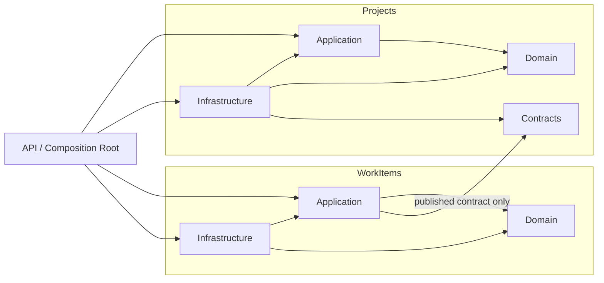

# Engineering Model Reference — Modular Monolith + Claude Code

[](https://github.com/RashidHusainat/engineering-model-reference/actions/workflows/ci.yml)

> An executable Proof of Concept for a lightweight **Engineering Knowledge & Verification Model**, implemented as a real .NET modular monolith with DDD-oriented boundaries and a thin Claude Code layer.

This repository is intentionally substantial enough to discuss with a Software Architect, but small enough that the engineering model remains visible. It is inspired by the modular decomposition discipline demonstrated by `kgrzybek/modular-monolith-with-ddd`; the code and domain here are original and deliberately smaller.

## What this PoC proves

```text
Business + Technical Source of Truth
                ↓
        Explicit Decisions
                ↓
           Implementation
                ↓
      Executable Verification
                ↓
   Shared Verification Entry Point
       ↙        ↓        ↘
 Developer   Claude    Git Hook
                ↓
               CI   ← authoritative
                ↓
        Risk-Appropriate Review
```

The same repository remains valid if Claude Code is removed. Claude reads the same Source of Truth and invokes the same verification entry point as a human developer.

## Technology choices

- .NET 10 / C# 14
- ASP.NET Core Minimal API
- Modular Monolith
- DDD-oriented Domain / Application / Infrastructure boundaries
- SQLite through `Microsoft.Data.Sqlite` (direct ADO.NET-style access, no ORM)
- NUnit
- NetArchTest
- `WebApplicationFactory` integration tests
- GitHub Actions + Azure Pipelines examples
- Claude Code project instructions, scoped rules, and small reusable Skills

The SQLite and no-ORM choices keep the PoC self-contained; they are not universal architecture mandates.

## Repository map

```text
.
├── docs/
│   ├── business/                    # Business Source of Truth
│   ├── architecture/                # Architecture, living map, C4 + drift view
│   ├── decisions/                   # ADRs
│   └── engineering-model/           # Engineering Knowledge & Verification Model
├── specs/                           # C/D change plans only
├── src/
│   ├── BuildingBlocks/
│   ├── Modules/
│   │   ├── Projects/
│   │   │   ├── Domain/
│   │   │   ├── Application/
│   │   │   ├── Contracts/
│   │   │   └── Infrastructure/
│   │   └── WorkItems/
│   │       ├── Domain/
│   │       ├── Application/
│   │       └── Infrastructure/
│   └── EngineeringModel.Api/
├── tests/
│   ├── EngineeringModel.Modules.Projects.UnitTests/
│   ├── EngineeringModel.Modules.WorkItems.UnitTests/
│   ├── EngineeringModel.ArchitectureTests/
│   └── EngineeringModel.Api.IntegrationTests/
├── eng/                             # ONE verification implementation
├── .githooks/                       # Local trigger → eng/verify.ps1
├── .claude/                         # Claude rules + optional Skills
├── .github/workflows/               # GitHub CI → eng/verify.ps1
├── azure-pipelines.yml              # Azure CI → eng/verify.ps1
└── CLAUDE.md                        # Thin project operating context
```

## The sample business behavior

Two modules exist for a reason: they create a real cross-module rule without requiring distributed infrastructure.

- A `Project` starts as `Draft` and can be activated.
- A `WorkItem` can be created only for an **Active Project**.
- `WorkItems.Application` asks Projects through `Projects.Contracts.IProjectsCatalog`.
- WorkItems cannot reference Projects Domain/Application/Infrastructure directly.

This gives us both business behavior to test and architecture boundaries to enforce.

## Intended module architecture



The architecture test does not “discover” this design. The team decides the rule first (`docs/architecture` + ADRs), then tests encode the objective part.

## Shared Verification Entry Point

`eng/verify.ps1` owns the actual verification logic.

| Profile | Intended use | Evidence |
|---|---|---|
| `PreCommit` | very fast local feedback | restore + build/analyzers |
| `PrePush` | normal local gate | build + unit + architecture tests |
| `Pr` | pull-request CI | build + unit + architecture + integration tests |
| `Main` | authoritative main-branch verification | PR evidence + generated-template smoke verification |

Run manually:

```powershell
./eng/verify.ps1 -Profile PrePush
```

Run the deepest repository + template verification:

```powershell
./eng/verify.ps1 -Profile Main
```

Install the tracked Git pre-push hook:

```powershell
./eng/install-git-hooks.ps1
```

Git hooks, Claude Code, GitHub Actions, and Azure Pipelines do **not** contain their own copy of the checks. They call `eng/verify.ps1`.

## Architecture rules that fail mechanically

Examples encoded in `EngineeringModel.ArchitectureTests`:

- Projects.Domain must not depend on Projects.Application, Projects.Infrastructure, or API.
- WorkItems.Domain must not depend on WorkItems.Application, WorkItems.Infrastructure, API, or Projects.
- Application must not depend on Infrastructure or API.
- WorkItems.Application may consume Projects **only through Projects.Contracts**.

### Demo a deliberate violation

The demo script temporarily introduces an illegal `WorkItems.Domain → Projects.Infrastructure` dependency, expects verification to reject it, and restores the repository in `finally`:

```powershell
./eng/demo-architecture-violation.ps1
./eng/verify.ps1 -Profile PrePush
```

The second command should be green after the temporary violation is removed.

## Claude Code integration

The integration is intentionally thin:

```text
CLAUDE.md
   ├─ points to Business / Architecture / ADR Source of Truth
   ├─ defines A-D task-risk behavior
   ├─ explains non-negotiable boundaries
   └─ routes verification to eng/verify.ps1

.claude/rules/
   ├─ architecture.md   (path-scoped)
   └─ testing.md        (path-scoped)

.claude/skills/
   ├─ plan-change/      (C/D planning only)
   ├─ verify-change/    (selects shared verify profile)
   ├─ review-change/    (independent challenge, no silent rewrite)
   └─ arch-wiki/        (optional living architecture + C4 + drift dashboard)
```

There is intentionally **no** AI-only architecture checker, no permanent multi-agent pipeline, and no duplicate governance system.

The future Skill for generating/updating executable tests from approved Source of Truth is intentionally **not included** in this PoC; that capability should be added only after the core model is proven.

## Optional living architecture — arch-wiki

`arch-wiki` treats the codebase as **observed architecture reality** and compares it with architecture documentation/ADRs before synchronizing the living map.

```text
Observed Code ──────┐
                    ├─> Compare ─> MATCH | CODE_ONLY | DOCS_ONLY | CONFLICT
Recorded Docs/ADRs ─┘                      │
                                           ▼
                              Smart drift/conflict record
                                           │
                                           ▼
                              architecture.json + C4 dashboard
```

A conflict is never reduced to “docs differ from code”. The dashboard shows:

**Expected → Observed → Code Location → Docs/ADR Location → Why → Impact → Resolution**

C4 usage is intentionally bounded:

- C1 System Context — always;
- C2 Containers — when applicable;
- C3 Components — per important module/service;
- C4 Code — on demand only.

The current reference manifest is `docs/architecture/architecture.json`. Generate the dashboard with:

```bash
python docs/architecture/build_html.py
```

Generate a clearly-labelled synthetic conflict for an architect demo without changing the live manifest:

```bash
python docs/architecture/build_html.py --demo-conflict --output docs/architecture/architecture-conflict-demo.html
```

This Skill is a visibility/drift layer. NetArchTest + CI still own deterministic enforcement.

## Claude permission posture

`.claude/settings.json` demonstrates least privilege:

- allow normal `dotnet` verification, architecture dashboard generation, and read-only Git inspection;
- ask before `git commit`;
- deny `git push` and sensitive `.env`/secret reads.

Repository policy and CI remain the enforcement authority. Claude permissions are local assistance, not the team-wide guarantee.

## CI

Every caller routes into the repository-owned verification implementation:

```text
Developer CLI ───────────────┐
Claude Code ─────────────────┤
Git pre-push ── PrePush ─────┼──> eng/verify.ps1
GitHub Pull Request ── Pr ───┤
GitHub main push ── Main ─────┤
Azure Pipelines sample ── Pr ─┘
```

`Main` additionally installs the repository as a real `dotnet new` template, generates a renamed solution in a temporary directory, builds it, and runs its `PrePush` verification. This catches template/substitution drift that a green source repository alone would miss.

CI is authoritative because local hooks can be bypassed or misconfigured.

## Five-minute architect walkthrough

1. **Start with the problem:** knowledge and rules drift between docs, code, tests, review, and AI prompts.
2. Open `docs/business/work-management.md` and `docs/architecture/overview.md` — show Business vs Technical Source of Truth.
3. Open ADR 0002 — show the explicit decision that WorkItems can use Projects only through Contracts.
4. Open `ModuleBoundaryTests.cs` — show the decision becoming executable verification.
5. Open `eng/verify.ps1` — show one implementation called by Developer, Claude, Git hook, and CI.
6. Run `PrePush` green.
7. Run `demo-architecture-violation.ps1` — show architecture drift rejected mechanically.
8. Open `CLAUDE.md` — show Claude is routed into the existing engineering system rather than becoming a second one.
9. Optionally show `arch-wiki` conflict dashboard — connect code evidence, docs/ADR evidence and C4 impact.
10. Show the `Main` CI/template smoke result — prove the repository also generates a valid renamed starter solution.
11. End with the key claim: **normal engineering first; AI optional; critical objective rules deterministic.**

## Run the application

Prerequisite: .NET 10 SDK.

```powershell
dotnet restore EngineeringModel.Reference.sln
dotnet run --project src/EngineeringModel.Api/EngineeringModel.Api.csproj
```

Then use:

- `POST /api/projects/`
- `POST /api/projects/{id}/activate`
- `POST /api/work-items/`
- `POST /api/work-items/{id}/complete`

SQLite creates `engineering-model.db` locally and it is ignored by Git.

## What is intentionally deferred

The model supports stronger tools when risk justifies them, but this PoC does not install everything at once:

- Stryker.NET scheduled mutation audits
- FsCheck property testing
- Pact.NET consumer-driven contracts
- NDepend deep codebase health analysis
- BDD/Reqnroll
- AI Skill that creates architecture/contract tests from approved decisions

Adding all of them now would make the demonstration about tooling rather than the engineering model.

## Use it as a `dotnet new` template

The repository contains `.template.config/template.json`:

```powershell
dotnet new install .
dotnet new engmodel-mm -n Contoso.WorkManagement -o ../Contoso.WorkManagement
```

The template engine replaces the `EngineeringModel` source name across namespaces and filenames. The `Main` CI profile continuously smoke-tests this behavior by generating a `TemplateSmoke` solution and running the generated repository's verification.

## From PoC to organization template

The reference implementation and generic template are mechanically validated in CI. Before adopting it as an organization-wide starter:

1. lock package/tool versions approved by the team;
2. decide the default module skeleton;
3. parameterize organization-specific names and conventions;
4. retain Source-of-Truth folders, shared verification, architecture tests, CI wiring, and thin Claude integration;
5. add only organization-specific policies that have clear ownership and an appropriate enforcement mechanism.

At that point, this reference becomes an organization starter template rather than a design experiment.
