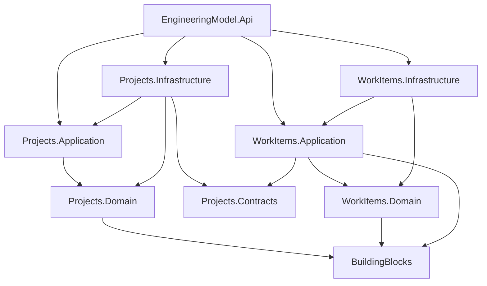

# Architecture Overview

## Style

A **modular monolith** with explicit module boundaries and DDD-oriented internal layering. The goal is strong module ownership without the operational cost of microservices.

## Module boundary rules

1. Module internals are private from other modules.
2. Cross-module interaction is allowed only through the target module's `Contracts` project.
3. Domain assemblies do not depend on Application, Infrastructure, API, or another module.
4. Application assemblies do not depend on Infrastructure or API.
5. Infrastructure implements module persistence and external technical concerns.
6. API is the composition root; it may wire Application and Infrastructure projects.

## Data ownership

For the PoC, both modules use one SQLite database for easy execution, but each module owns its own tables:

- `projects_projects`
- `workitems_items`

Sharing a physical database does not make direct cross-module table access an approved integration mechanism.

## Why no CQRS framework / event bus / ORM?

They are not needed to prove the model. The PoC uses small application handlers and ADO.NET-style SQLite access so the architectural signal stays visible. Those choices are not mandates for every future system.
